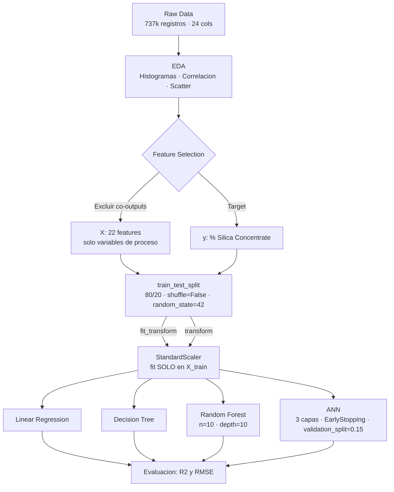

# Mining Quality Prediction — Iron Ore Flotation


Prediccion del **% de Silice en el concentrado de hierro** durante el proceso de flotacion industrial, usando datos de sensores de planta en tiempo real. Se comparan cuatro enfoques: Regresion Lineal, Decision Tree, Random Forest y una Red Neuronal Artificial (ANN).

Este proyecto documenta explicitamente los errores de **data leakage** presentes en la mayoria de implementaciones publicas de este dataset, corrige el pipeline y reporta metricas honestas.

---

## Tabla de Contenidos

1. [Problema](#problema)
2. [Datos](#datos)
3. [Metodologia](#metodologia)
4. [Resultados](#resultados)
5. [Analisis de Data Leakage](#analisis-de-data-leakage)
6. [Conclusiones](#conclusiones)
7. [Reproducibilidad](#reproducibilidad)
8. [Referencias](#referencias)

---

## Problema

### Contexto

En el procesamiento de mineral de hierro, la **flotacion** es la etapa critica que separa el mineral valioso (Fe) de las impurezas, principalmente **silice (SiO2)**. El contenido de silice en el concentrado final es el principal indicador de calidad del producto:

- **Alto % SiO2** → Mayor escoria en el horno → Mayor consumo energetico → Menor eficiencia
- **Bajo % SiO2** → Concentrado de alta pureza → Mayor valor comercial → Proceso eficiente

El problema del control de calidad tradicional es que los **analisis de laboratorio tienen latencia de horas**, lo que impide ajustes en tiempo real al proceso de flotacion.

### Objetivo

Construir un modelo predictivo que estime el **% de Silice en el concentrado** usando unicamente variables de proceso medidas en tiempo real por sensores, permitiendo intervencion anticipada antes de que el producto fuera de especificacion llegue al analisis de laboratorio.

### Propuesta de valor

```
Latencia analisis de laboratorio:  ~2 horas
Latencia prediccion del modelo:    ~segundos
Ventana de intervencion ganada:    ~2 horas de proceso
```

---

## Datos

### Origen

| Atributo | Detalle |
|---|---|
| **Dataset** | [Quality Prediction in a Mining Process — Kaggle](https://www.kaggle.com/datasets/edumagalhaes/quality-prediction-in-a-mining-process) |
| **Fuente** | Sensores de planta metalurgica real (anonimizada) |
| **Periodo** | Marzo - Septiembre 2017 (6 meses) |
| **Frecuencia** | Cada 20 segundos (proceso) / cada hora (laboratorio) |
| **Filas** | ~737,453 registros |
| **Columnas** | 24 variables |
| **Licencia** | CC0: Public Domain |

### Variables principales

```
VARIABLES DE PROCESO (features — disponibles en tiempo real):
├── % Iron Feed           — % de hierro en la alimentacion
├── % Silica Feed         — % de silice en la alimentacion
├── Starch Flow           — Flujo de almidon (depresor)
├── Amina Flow            — Flujo de amina (colector)
├── Ore Pulp Flow         — Flujo de pulpa de mineral
├── Ore Pulp pH           — pH de la pulpa
├── Ore Pulp Density      — Densidad de la pulpa
└── Flotation Column [1-7] Air Flow / Level

VARIABLES DE LABORATORIO (outputs del proceso — medidas con latencia):
├── % Iron Concentrate    — EXCLUIDA: co-output del proceso (ver Analisis de Leakage)
└── % Silica Concentrate  — TARGET: variable a predecir
```

---

## Metodologia

### Arquitectura del pipeline



### Decisiones de diseno

#### Split cronologico

Los datos provienen de sensores con frecuencia de 20 segundos durante 6 meses. Existe autocorrelacion temporal: el estado del proceso en `t` depende del estado en `t-1`. Se aplica `shuffle=False` para respetar la causalidad:

- Train: primeros 80% del periodo cronologico (marzo - agosto 2017)
- Test: ultimos 20% (agosto - septiembre 2017)

Un split aleatorio permitiria que el modelo aprenda del futuro para predecir el pasado.

#### Escalamiento post-split

El `StandardScaler` se fittea exclusivamente sobre `X_train`. Aplicar `fit_transform` sobre el dataset completo antes del split filtra estadisticas del test set hacia el entrenamiento, produciendo metricas optimistas no reproducibles en produccion.

#### Modelos

| Modelo | Decision de diseno |
|---|---|
| Regresion Lineal | Baseline para verificar linealidad del proceso |
| Decision Tree | Herramienta exploratoria — overfitting esperado sin restriccion de profundidad |
| Random Forest | `n_estimators=10`, `max_depth=10` — exploracion inicial con control de overfitting |
| ANN | 3 capas densas (128-64-32), Dropout(0.2), EarlyStopping(`patience=10`), `validation_split=0.15` |

---

## Resultados

| Modelo | R² | Observacion |
|---|---|---|
| Regresion Lineal | Bajo | Confirma no-linealidad. Residuos muestran striations tipicas de datos industriales. |
| Decision Tree | ~1.00 | Overfitting severo — no valido como predictor |
| Random Forest | Moderado | Mejor modelo clasico. Mejora posible con tuning de hiperparametros. |
| ANN | ~0.01 | Overfitting estructural. Arquitectura densa inadecuada para datos temporales. |

### Hallazgos del analisis de residuos (Regresion Lineal)

1. **Violacion de linealidad:** tendencia sistematica en residuos vs. valores predichos
2. **Striations:** patrones discretos que sugieren multiples estados de operacion (cambios de turno, mantenimiento, variaciones de alimentacion)
3. **Heterocedasticidad:** varianza no constante confirmada por test de Breusch-Pagan

### Comportamiento de la ANN

El grafico de perdida muestra una brecha amplia entre `train_loss` y `val_loss` que no converge. El modelo memoriza el training set pero falla en generalizar. Esto es una consecuencia esperada: una arquitectura densa trata cada fila como independiente e ignora la dependencia temporal, que es la estructura fundamental de este dataset.

---

## Analisis de Data Leakage

Esta seccion documenta los errores metodologicos identificados en la version inicial del proyecto y presentes en la mayoria de implementaciones publicas de este dataset.

### Leakage 1 — Variable de Output como Feature (critico)

**El error:** Incluir `% Iron Concentrate` como feature de entrada para predecir `% Silica Concentrate`.

**Por que es leakage:** Ambas variables son **co-outputs** del proceso de flotacion. Se miden simultaneamente en el concentrado final, en el mismo analisis de laboratorio. Al momento de hacer una prediccion real, ninguna de las dos esta disponible — son precisamente lo que se quiere predecir.

**La evidencia:** La correlacion negativa de ~0.99 entre ambas variables es la firma de que son co-outputs, no una relacion causa-efecto input→output.

**Impacto en metricas:** Los notebooks que incluyen `% Iron Concentrate` reportan R² muy cercano a 1.0. Investigadores de TechLabs Aachen midieron el impacto directamente: RMSE de 0.161 con la variable vs. RMSE de 0.193 sin ella — una diferencia de rendimiento atribuible exclusivamente al leakage.

### Leakage 2 — Scaler Fitteado Antes del Split

**El error:**
```python
# Incorrecto
scaler.fit_transform(dataset_completo)
X_train, X_test = train_test_split(...)
```

**Por que es leakage:** La media y desviacion estandar calculadas sobre el dataset completo contienen informacion del test set. El modelo entrena con estadisticas del futuro.

**La correccion:**
```python
# Correcto
X_train, X_test = train_test_split(...)
X_train = scaler.fit_transform(X_train)  # fit solo en train
X_test  = scaler.transform(X_test)       # solo transform en test
```

### Leakage 3 — Shuffle en Datos Temporales

**El error:** `train_test_split` con `shuffle=True` (default) en datos de series temporales.

**Por que es leakage:** Permite que muestras del futuro aparezcan en el training set, violando la causalidad del proceso industrial.

---

## Conclusiones

### Aprendizaje tecnico principal

La mayoria de implementaciones publicas de este dataset en Kaggle y Medium obtienen R² alto porque incluyen `% Iron Concentrate` como feature. Esas metricas no son reproducibles en produccion porque dependen de una variable que no existe al momento de hacer la prediccion real — el concentrado aun no ha sido analizado.

Un modelo con metricas honestas y bajas es mas util que un modelo con metricas infladas e inservibles.

### Limitaciones de esta version

- La ANN densa no es la arquitectura correcta para datos con dependencia temporal
- Random Forest no explota la estructura temporal del dataset
- No se realizo busqueda sistematica de hiperparametros

### Roadmap

| Prioridad | Tarea |
|---|---|
| Alta | Implementar LSTM — arquitectura correcta para series temporales industriales |
| Alta | Feature engineering temporal: lags, rolling means, diferencias entre periodos |
| Media | Hyperparameter tuning de Random Forest con RandomizedSearchCV |
| Media | Multi-Target Regression: prediccion conjunta de % Iron y % Silica Concentrate |
| Baja | Agregar metricas adicionales: MAE, MAPE para interpretacion en unidades reales |

---

## Reproducibilidad

### Requisitos

```
Python >= 3.10
```

### Instalacion

```bash
git clone https://github.com/tu-usuario/mining-quality-prediction.git
cd mining-quality-prediction
pip install -r requirements.txt
```

### Datos

El dataset no se incluye en el repositorio. Descargarlo desde Kaggle:

```bash
# Opcion 1: Kaggle CLI
kaggle datasets download -d edumagalhaes/quality-prediction-in-a-mining-process
unzip quality-prediction-in-a-mining-process.zip -d data/raw/

# Opcion 2: Descarga manual
# https://www.kaggle.com/datasets/edumagalhaes/quality-prediction-in-a-mining-process
# Mover el CSV a data/raw/mining_data.csv
```

### Estructura del proyecto

```
mining-quality-prediction/
├── README.md
├── requirements.txt
├── .gitignore
├── data/
│   ├── raw/               <- mining_data.csv (no versionado)
│   └── processed/
├── notebooks/
│   └── Mining-Quality-Prediction.ipynb
├── src/
│   ├── __init__.py
│   ├── data_processing.py
│   ├── models.py
│   └── utils.py
├── models/
├── results/
│   └── plots/
└── docs/
    └── architecture.md
```

### Ejecucion

```bash
jupyter notebook notebooks/Mining-Quality-Prediction.ipynb
```

---

## Referencias

- Magalhaes, E. (2018). *Quality Prediction in a Mining Process*. Kaggle. https://www.kaggle.com/datasets/edumagalhaes/quality-prediction-in-a-mining-process
- Dolgan, A. (2019). Multi-Target Regression for Quality Prediction in a Mining Process. *IEEE*. https://ieeexplore.ieee.org/abstract/document/8907120
- TechLabs Aachen (2022). *Quality Prediction in a Mining Process*. Medium. https://techlabs-aachen.medium.com/quality-prediction-in-a-mining-process-1a2b70b51303
- Breiman, L. (2001). Random Forests. *Machine Learning*, 45, 5-32.
- Kaufman, S., et al. (2012). Leakage in Data Mining: Formulation, Detection, and Avoidance. *ACM TKDD*, 6(4).
- Géron, A. (2022). *Hands-On Machine Learning with Scikit-Learn, Keras & TensorFlow* (3rd ed.). O'Reilly.

---

*Proyecto en desarrollo activo — proximo paso: implementacion de LSTM.*
